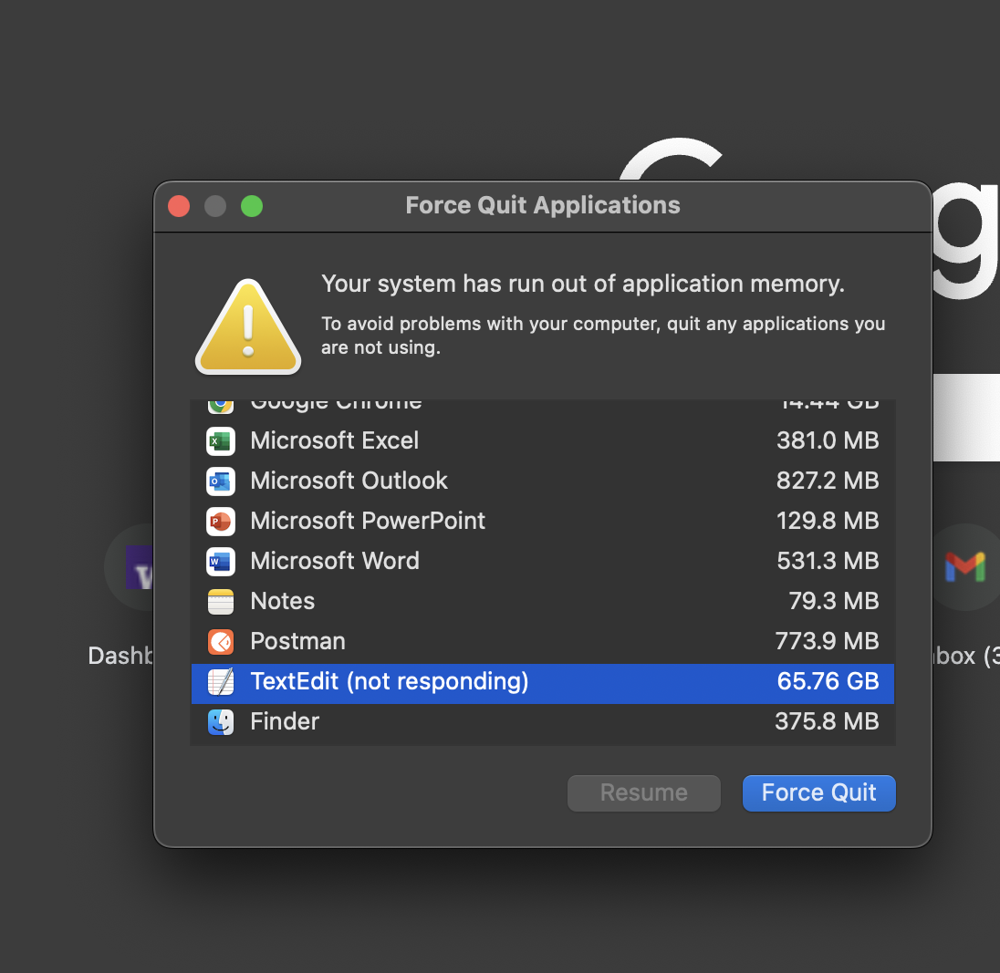

# MRF Stream Parser


## Overview

As part of my healthcare startup, I want to learn more about Machine-Readable Files from insurance providers about Transparency in Coverage (TiC). 

Very often, these TiC files are a 500 MB --> 20 GB GZIP-Compressed JSON that decompress to be much larger. An article by [Matthew Robben](https://www.serifhealth.com/blog/a-primer-on-mrf-structure-how-to-find-a-rate#:~:text=You%20go%20to,to%20119.39%20GB) spoke about the size of these uncompressed files, mentioning that United Healthcare has a 100:3 compression ratio for these files. Daunting - I almost want to give up. 

Anyway, I want to be able to access a GZIP file from any point within the file without having to start searching from the beginning. What if I only want to start searching from the second half of the file? 

The issue with a GZIP file is that, even though you can stream content from it, you need to decompress all the data that precedes the data you want to access.

So as a proof of concept, and for Daniel Brandao mentioning he wants to see my code, I'm going to try to figure out how to do random access to GZIP files. Evidently, if you can stream from beginning to end of a GZIP file, there has to be a way to continue streaming from a pre-indexed point. Maybe.

I don't know if this is possible yet, but from the info I read from [GZTool](https://github.com/circulosmeos/gztool), I think it may be possible - and apparently a lot of other projects have tried to do this. 

```If you want to tail generic gzip files (including bgzip files!), you can use gztool.  -- @circulosmeos, github```

I don't want to reinvent the wheel - especially a wheel that may be beyond by abilities to carve out in an afternoon - so in this project, I am going to try to understand how these tools work, then apply them to a real use-case that I have been working on building. 

## Table of Contents
- [Overview](#overview)
- [Table of Contents](#table-of-contents)
- [General Roadmap](#general-roadmap)
- [Background Information](#background-information)
- [Scripts](#scripts)
- [Data Sources](#data-sources)
- [Contributing](#contributing)
- [License](#license)

## General Roadmap

1. Figure out how to stream a plain GZIP file from a random point (or reasonable breakpoints). 

2. Find information within that GZIP file by streaming.

3. Figure out how much time it takes to search for that piece of information through **regular** GZIP streaming vs **random data extraction** GZIP streaming.
    - For Random Data Extraction: Binary Search or Parallel Distributed Binary Search maybe? 

4. Figure out if the indexes I create with GZIP are actually helpful
    - Are the MRF files actually sorted or am I wasting my time? 
    Other than increasing search speeds of pre-indexed GZIP files, how will this project actually help me find the piece of information I want quickly - especially if Insurance Providers don't sort their JSON data? 


## The Process

### Step 1: Stream a GZIP file from a random point

#### Setup gztool for MacOS ARM64

I'm going to start by attempting the gztool repo. I already created a notebook where I played with igzip, a python package that indexes gzip files and creates a list of indexes. However, since we need to go over petabytes of data, and I want a faster way to create indexes With much smaller index sizes.

Wait this may be easier than I thought. First start by downloading the file:

[Download the file we want to index](#scripts)

If you want to view what's in it, extract it:

```

tar -xvzf ./test-data/lifewise/secondary-gzipped/test-file.gz -C ./test-data/lifewise/secondary-gzipped/

# Print head/tail by characters because of large line sizes
head -c 5000 ./test-data/lifewise/secondary-gzipped/test-file | more

tail -c 5000 ./test-data/lifewise/secondary-gzipped/test-file | more


```

But don't open the file! You need a specialized text editor capable of viewing only parts of a file at a time. 




We can see what type of info is in the file with the aformentioned head and tail files. 

Now let's figure out how to use that gztool to create that index file. You'll need Ubuntu for this for compiled releases, but you can compile it for MacOS Arm64 too. 

```

git clone https://github.com/circulosmeos/gztool.git

```

I did need to add darwin compiler support for MacOS Arm64, which was easier than I expected. Put it in gztool.c then compile like usual from makefile.

```

// need these for fseeko/ftello and snprintf
#ifdef __APPLE__
#define _DARWIN_C_SOURCE
#endif

```

I should probably re-learn C. This took a lot longer than necessary to figure out. 

Moving on - let's test gztool now that I compiled - does it work? Let's test some commands. 

```

# Add gztool to system command tools
sudo cp ./gztool /usr/local/bin/gztool 

# Test it
gztool -hh
```

Okay great. I have now gathered all materials. Here are questions I have:

- Should I download the entire gzip file first, then index it? Or should I index it as it is growing
    - For now, since I don't know anything about this tool, let's just try indexing 1) a fully-downloaded file first, or 2) a file that is being downloaded live. 
    - How do I know how much indexing I want to do? If there are 10s of Petabytes of data in aggregate for 700 different insurance providers, even the index files will be big. 
    - Now that I have a file with all the indexes, can I download only a chunk of the gzip from the internet using an HTTP range request, then still decompress it? That's my ultimate goal, all my efforts will become a waste of time if this part doesn't work. 


## Data Sources
- **Lifewise Health Plan of Washington**: JSON files containing in-network rates and allowed amounts. Example file: `2025-05-01_lifewise-health-plan-of-washington_index.json`.
- **Test Data**: A script to download test gzip files. Example script: `download_test_gzip.sh`.


## Scripts
- `download_test_gzip.sh`: Script to download a test gzip file for data processing.

    ```
    chmod +x ./init_scripts/download_test_gzip.sh
    ./init_scripts/download_test_gzip.sh
    ```

